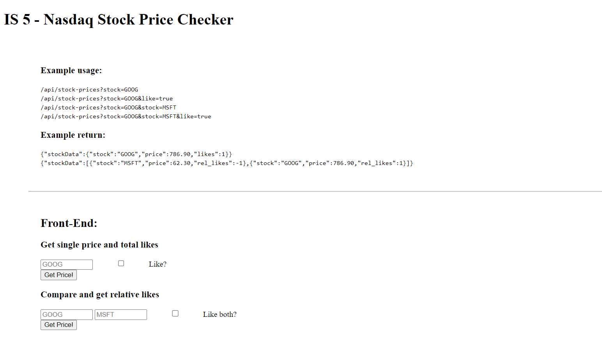
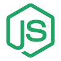

<h1 align="center">Anonymous Message Board 📨</h1>
<h3 align="center">A full stack web platform, that gives users the opportunity to communicate anonymously, like they would do on a forum, submitting new boards/threads/comments.</h3>

 FreeCodeCamp's source code: https://github.com/freeCodeCamp/boilerplate-project-messageboard/

 View FreeCodeCamp's deployment: https://anonymous-message-board.freecodecamp.rocks

  

    
    
    
    

## Features

This web application emulates the functionality of an anonymous forum giving its users the ability to:

  -  Create new boards/threads/comments (in hierarchical order) by completing input forms and each submit gets saved in the database (POST HTTP request)
    
  -  Read from the database every board along with its threads/replies using this URL parameter <code>"<deployment_URL>/b/<board_name>"</code> (GET HTTP request)
  
  -  Update current threads's/replies's status to reported by pressing (submitting) a report button (PUT HTTP request)
  
  -  Delete current threads/replies only after submitting a form with the correct delete password (requested when creating the thread/reply) (DELETE HTTP request)

## Installation

To try out this project yourself (instructions for bash CLI):

  1)  Clone this repo typing <code>git clone https://github.com/christosgkoutzis/Information_Security_Certification.git</code> 

  2)  Change branch to this project typing <code>git checkout origin/Anonymous_Message_Board</code>

  3)  Install required node packages typing <code>npm install</code> (If you haven't installed nodejs and/or npm you also need to run <code>sudo apt install nodejs npm</code>)

  4)  Create a <code>.env</code> and save the following environmental variables for the project:
      <code>NODE_ENV=test</code>
      <code>PORT=3000</code>
      <code>DB=<your_database's_connection_string></code>

  5)  Run the unit tests and deploy the project in debugging mode (applying changes of code asychronously) using <code>npm run dev</code> command

## Development

In this project, I developed the backend part of the platform in <code>api.js</code> and <code>db-connection.js</code> files, a bunch of security features in <code>server.js</code> file, the database models in <code>models.js</code> and 10 unit tests that ensure the required functionality of the project in <code>tests/2_functional-tests.js</code> file. More specifically:

Unit tests

  
  
In <code>tests/2_functional-tests.js</code> file, there is a suite of 10 functional unit tests, executed right after the <code>run</code> command and developed using chai-mocha assertion JS libraries. They execute and check the correct functionality of the following tasks:

  - Creating a new thread and reply (POST)
  
  - Reading the threads of a board as well as the replies of a thread (GET)
  
  - Updating threads and replies to reported status (PUT)
    
  - Deleting threads and replies using the correct or an incorrect delete password (DELETE)
  

Backend Development

  
  
  - The <code>db-connection.js</code> ensures the initialization of the database and the connection to the server
  
  - The <code>models.js</code> holds the board, model and reply schemas of the non relational MongoDB database, showing the hierarchical relations between the three.
  
  - The <code>api.js</code> implements the functionality mentioned in the unit tests, interacting with the database

